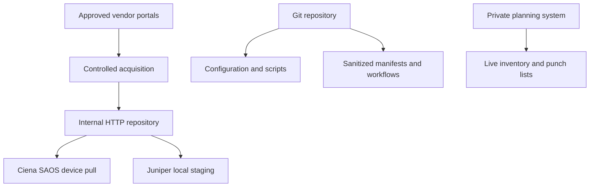

# Logical Architecture

## Responsibility boundaries

- Git versions the build logic, configuration, templates, sanitized engineering documentation, and lab evidence.
- A private planning system remains the system of record for live inventory, readiness, approvals, and production-specific data.
- The internal HTTP server stores approved vendor images and their verification data.
- Network devices only enter an upgrade wave after the target, path, storage, backup, staging, checksum, and rollback gates pass.
- Management-platform migration work is tracked separately from device software populations.

Public-facing documentation intentionally omits customer identifiers, production addresses, live inventory, credentials, and restricted vendor payload details.
